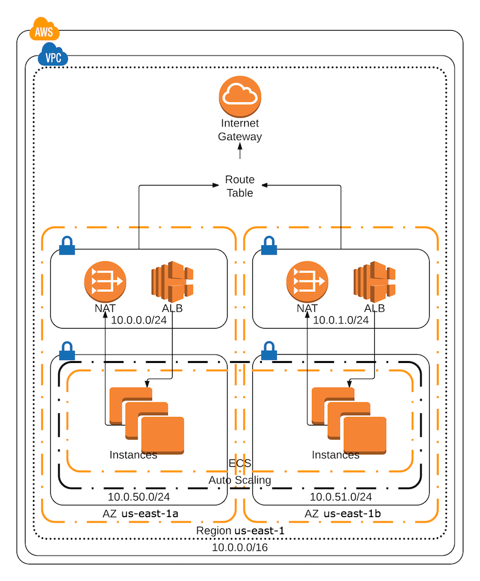

# terraform-ecs-ha-cluster-1

Apply this terraform project to create a self contained, highly available, production-ready ECS host cluster...
- with ha Consul
    - view Consul logs at Cloudwatch log group */ecs-ha-cluster-1/consul*
    - *terraform apply* will output the alb dns name 
- with ha Vault
    - view Vault logs at Cloudwatch log group */ecs-ha-cluster-1/vault*
    - *terraform apply* will output the alb dns name



## What are we creating?

* VPC with a /16 ip address range and an internet gateway
* We are choosing a region and a number of availability zones we want to use. For high-availability we need at least two
* In every availability zone we are creating a private and a public subnet with a /24 ip address range
  * Public subnet convention is 10.0.0.x and 10.0.1.x etc..
  * Private subnet convention is 10.0.50.x and 10.0.51.x etc..
* In the public subnet we place a NAT gateway and the LoadBalancer
* The private subnets are used in the autoscale group which places instances in them
* We create an ECS cluster where the instances connect to

## Project Architecture

The project is designed in such a way that we can create/manage this infrastructure within many different aws accounts.
- the */config-common/* directory contains the .tf files that actually create the infrastructure, but we'll never apply terraform directly against the files in this directory
- */config-sandbox-us-east-1/* is an environment specific directory, it contains symlinks to the tf files that exist within */config-common/*
- environment specific directories contain *terraform.tfvars*, this is where you specify the environment specific input variable values
- create more environment specific directories as needed
- [direnv](https://direnv.net/) is used to supply the correct aws creds, direnv is an environment switcher for the shell, check out [*/config-sandbox-us-east-1/envrc*](config-sandbox-us-east-1/envrc) for instructions

## How to initialize a new environment directory?

If you are adding a new environment directory, or if you are running this from a fresh install, you'll need to initialize terraform from within the environment specific directory. To accomplish this
you should run [*/init-remote-state.sh*](/init-remote-state.sh) from within the directory e.g...

```bash
# cd into the environment specific directory
cd config-sandbox-us-east-1

# initialize terraform, set remote state s3 bucket location
../init-remote-state.sh
```

- The */init-remote-state.sh* script sets the remote state bucket location. This bucket path is convention based... 
- *mb-{current dir name}-remote-state-bucket* = *mb-config-sandbox-us-east-1-remote-state-bucket*
- The s3 bucket must exist before you run this script.
- For more specific details, look here [*/init-remote-state.sh*](/init-remote-state.sh)

## How to create the infrastructure?

using the default terraform flow:

```bash
# cd into the environment specific directory
cd config-sandbox-us-east-1

#check that you are targeting the desired aws account
aws iam list-account-aliases 

# download module dependencies
terraform get -update=true

# check the plan
terraform plan

# create the infrastructure
terraform apply
```

## EC2 ssh access (key pair)

- To facilitate 100% self contained infra as code, we are supplying a pre-defined ssh key pair to the ecs terraform module
- notice the *key_pair_name* and *key_pair_public_key* values @ [*/config-sandbox-us-east-1/terraform.tfvars*](/config-sandbox-us-east-1/terraform.tfvars)
- If you need ssh access to the ecs instances, you will need the private key file, you'll find it in the *"mb-key-pairs"* s3 bucket,
keeping this bucket up to date is a manual act
- naming convention for the ssh private key file is... *"{environment}-{ecs-cluster-name}-kp.pem"* = *"sandbox-ecs-ha-cluster-1-kp.pem"* 
 